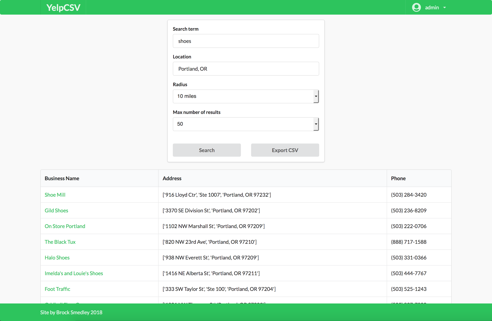

## How to use
1. Replace the AUTH string in *`app/parser.py`* with your own Yelp API key

2. If you want to use https, add your key and cert into the keys directory
    - You'll also have to modify the "cert authority secret link" function in *`app/app.py`*
    - If you don't want https, comment out the SSL context stuff (lines 10-17) in *`app/app.py`*, remove **`ssl_context`** from the **`app.run(...)`** call in *`app/app.py`*, and you might also change the ports in that function and the `docker-compose.yml` file (to 80 or whatever)

3. `docker-compose up`

